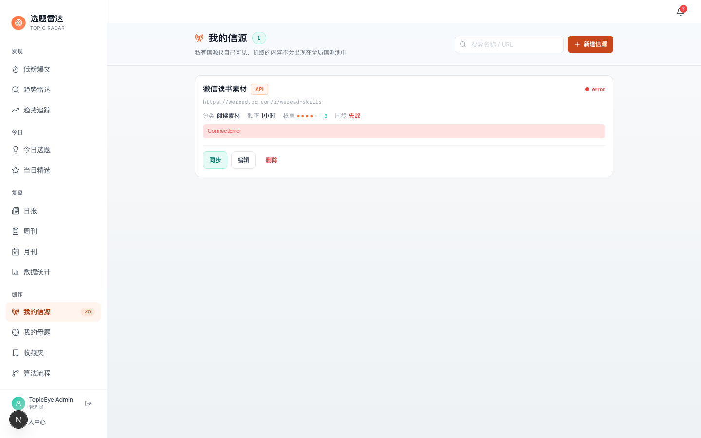
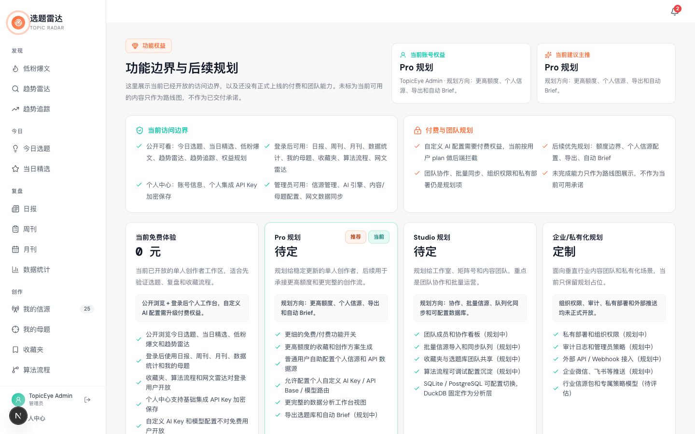
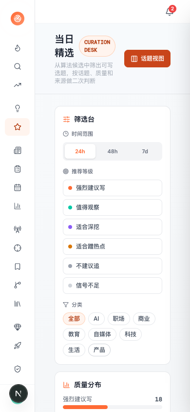
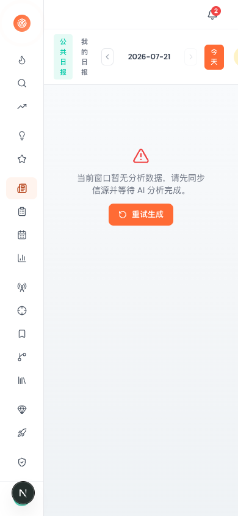
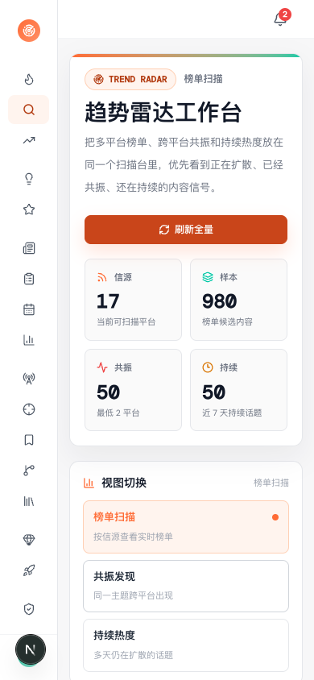
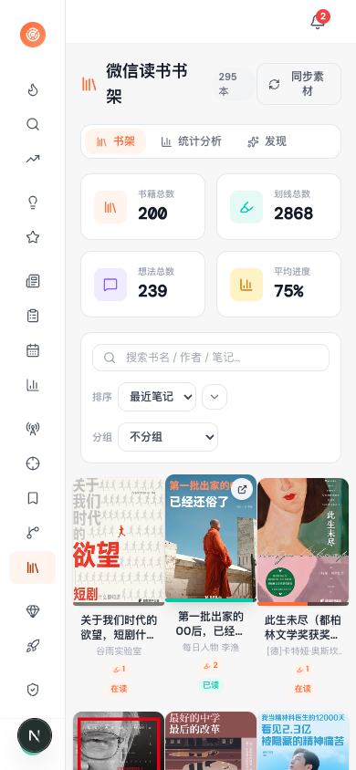
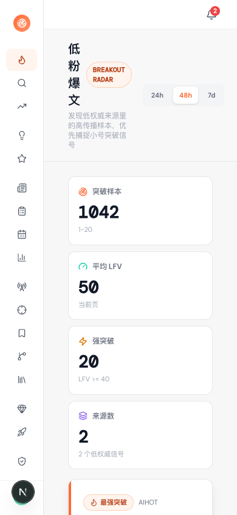
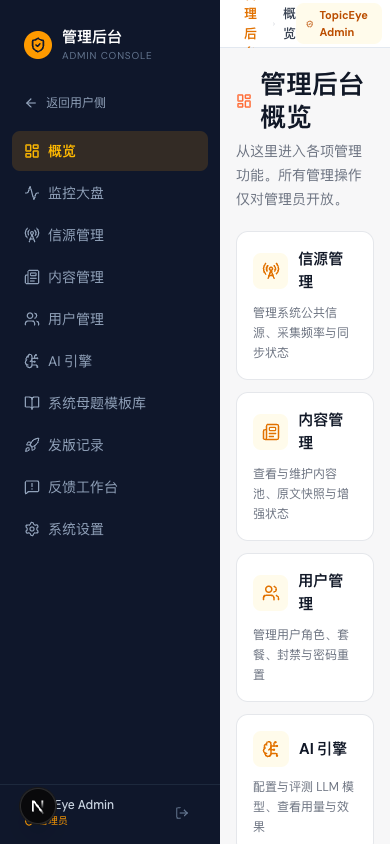
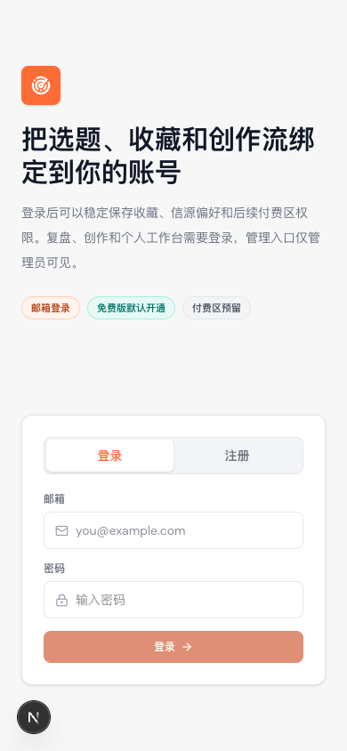

# TopicEye

**AI-powered content discovery and topic radar for creators.**

[](LICENSE)
[](https://github.com/fxbin/TopicEye/actions/workflows/ci.yml)
[](https://fastapi.tiangolo.com/)
[](https://nextjs.org/)

[English](README.md) | [简体中文](README.zh-CN.md)

---

TopicEye continuously crawls 25+ sources (RSS, Reddit, YouTube, podcasts, newsletters, trending boards), scores every item through a transparent 6-dimension engine, and surfaces the topics worth writing about today. It is built for content creators who are overwhelmed by noise and need curation with taste — not another feed reader.


## Why TopicEye

- **Transparent scoring engine, not a black box.** Every selected item ships with a full breakdown: base score (information density / actionability / creator value / viral potential / source authority / freshness), quality gates, time decay, diversity penalty, and feedback signal. See the [`algorithm` page](docs/screenshots/screenshot-algorithm.png) in the app.
- **Feedback closes the loop.** Your 👍 / 👎 doesn't just get saved — it is weighted at 15% and feeds back into ranking. The engine gets sharper the more you use it.
- **Multi-source intelligence.** 25+ crawl sources (RSS / Reddit / YouTube / podcasts / newsletters / trending boards) + WeRead reading stats + webnovel radar (Fanqie / Qimao / Zhihu Yanxuan). One platform, full-spectrum signal.
- **Self-host friendly.** Full Docker setup, SQLite or PostgreSQL, OAuth login (Google / GitHub). Your data stays yours.
- **Agent-native (planned).** The scoring engine is being exposed as a stable API so other agents and tools can call it as their ranking layer.

## Screenshots

### Core Discovery

| Today's Picks | Daily Report | Trending Radar |
|---|---|---|
|  |  |  |

| Trend Tracking | Low-Follower Viral | Algorithm Flow |
|---|---|---|
|  |  |  |

### Stats & Reports

| Stats Dashboard | Job Stats | Changelog |
|---|---|---|
|  |  |  |

| Weekly Report | Monthly Report | |
|---|---|---|
|  |  | |

### New Features — WeRead & Webnovel

| WeRead Stats | Webnovel Radar |
|---|---|
|  |  |

### User Workspace

| Favorites | My Topics | Topic Config |
|---|---|---|
|  |  |  |

| My Sources | Login | Plans |
|---|---|---|
|  |  |  |

| Profile | | |
|---|---|---|
|  | | |

### Admin Console

| Admin Overview | Source Management | Content Management |
|---|---|---|
|  |  |  |

| User Management | AI Engine (Model Eval) | Mother Topics |
|---|---|---|
|  |  |  |

| Release Notes | Feedback Workbench | System Settings |
|---|---|---|
|  |  |  |

### Mobile Responsive (iPhone 14 / 390 × 844)

| Today's Picks | Daily Report | Trending Radar |
|---|---|---|
|  |  |  |

| WeRead | Low-Follower Viral | Admin | Login |
|---|---|---|---|
|  |  |  |  |

## Features

| Module | Description |
|---|---|
| **Source management** | RSS / RSSHub / Reddit / YouTube / Podcasts / Newsletters / custom sites. Public sources + private sources per user. |
| **Curation scoring** | 6-dimension weighted engine + P70 percentile cutoff + risk control + user feedback calibration. |
| **AI analysis** | Per-item summary, key points, topic suggestions (differentiated prompts for CN/EN content). |
| **Daily / weekly / monthly reports** | Auto-generated from the content pool, with timeline view and scrollable history. |
| **Trend radar** | Topic trending + low-follower viral detection (find breakout posts before they peak). |
| **WeRead integration** | Sync reading stats and bookshelf from WeRead API; daily auto-refresh cache, reading-time analytics, and bookshelf comparison. |
| **Webnovel radar** | Fanqie / Qimao / Zhihu Yanxuan trending charts, gated behind a runtime feature flag. |
| **Mother topics** | Multi-tenant topic templates — admins maintain the system library, users fork their own and customize keywords, weights, and target readers. Fork edits take effect immediately in the scoring queue. |
| **AI model evaluation** | Admin UI to compare LLM models side-by-side on the same prompts, track quality and cost, and pick the right routing group per task. |
| **Email verification** | Transactional email via Brevo API or any SMTP provider (QQ Enterprise / Gmail / etc.), configured from the admin settings page. |
| **Article reader** | In-app reader for source URLs — fetches public HTML only, no auth/cookies/captcha bypass, with SSRF guard and snapshot caching. |
| **Favorites** | Save items across sessions (per-user). |
| **My topics** | Personalized topic configuration with mother-topic fork, keyword filters, and scoring overrides. |
| **Admin console** | Full management UI: sources, content, users, AI model evaluation, mother-topic templates, release notes, feedback, and system settings. |
| **OAuth login** | Google / GitHub (email + password also supported). |
| **Rate limiting** | Per-endpoint budgets for login, registration, and LLM calls. |

## Architecture

### Backend layering

Strict one-way dependency (see [AGENTS.md](AGENTS.md) for the full rules):

```text
api/v1/ ──► services/ ──► repositories/ ──► models/ ──► sqlalchemy
```

| Layer | Owns | Must not |
|---|---|---|
| `api/v1/` | Route declarations, request validation, response shaping | `import sqlalchemy` (except `AsyncSession` type hint), direct ORM queries |
| `services/` | Business orchestration, transaction boundaries, cross-repo composition | — |
| `repositories/` | Single entry point for ORM, CRUD + complex query encapsulation | Importing each other, business logic |
| `models/` | Pure ORM declarations, field definitions, `__table_args__` | Business methods, side effects, IO |
| `schemas/` | Pydantic request/response models, serialization | ORM imports, DB access |

Cross-cutting: `core/` (config, DB, logging, retry), `middleware/` (rate limit, request metrics), `services/email/` (Brevo + SMTP), `services/llm/` (failover, circuit breaker, response cache), `services/scrapers/` + `services/trending_scrapers/` (per-source fetchers).

### Scoring engine

The 6-dimension base score (weights sum to 1.0):

| Dimension | Weight | What it measures |
|---|---|---|
| Information density | 0.25 | Signal-to-noise ratio of the content |
| Actionability | 0.20 | Can the reader do something with this today? |
| Creator value | 0.18 | Usefulness for someone writing about this topic |
| Viral potential | 0.15 | Likelihood of breaking out |
| Source authority | 0.12 | Trust weight of the originating source |
| Freshness | 0.10 | Recency decay (`exp(-0.02 × hours)`, floor 0.3) |

Post-processing:

- **Quality gates** — items below 45 are too thin; above 70 are fully trusted.
- **Risk control** — hard-exclude above 82, soft-degrade starting at 45.
- **Diversity penalty** — 0.85× per same-source duplicate, 0.92× per same-category duplicate (with grace slots).
- **Percentile cutoff** — top ~30% (P70 and above) selected.
- **Feedback signal** — 👍 / 👎 weighted at 15%, clamped at ±20 per item to prevent domination.
- **Curation floor** — minimum base score 58; the engine refuses to surface weak items just because the batch is weak.

Full config in [backend/app/services/scoring_engine.py](backend/app/services/scoring_engine.py).

### Source matrix

| Category | Sources |
|---|---|
| RSS / RSSHub | Any RSS feed, RSSHub routes (custom sites, blogrolls) |
| Aggregators | Reddit, Hacker News, GitHub Trending, V2EX, Juejin, Sspai, ITHome, 36Kr |
| Social / short video | Weibo, Douyin (hot + trending), Bilibili, Tieba, Zhihu trending |
| Finance | Xueqiu, Eastmoney, Netease Finance, Sohu Finance |
| Discovery | Douban, Hupu, Heiyan, Ishugui, Xyzrank, Toutiao, Baidu |
| Long-form | YouTube, Podcasts, Newsletters |
| Reading | WeRead (reading stats + bookshelf via official gateway) |
| Webnovel | Fanqie, Qimao, Zhihu Yanxuan (runtime feature flag, off by default) |

### Database choices

- **SQLite** — default for local / single-user deployments. Zero-ops, single file. Write-lock contention handled via `SQLITE_BUSY_TIMEOUT_MS` (30s default, 500ms for batch writes).
- **PostgreSQL 16** — recommended for multi-user / production. CI runs the test suite against both to catch cross-DB regressions.
- **DuckDB** — read-only analytics layer over the OLTP database. Powers stats dashboards without burdening the write path. Memory and thread budgets configurable via `DUCKDB_THREADS` / `DUCKDB_MEMORY_LIMIT`.

## Tech stack

- **Backend:** FastAPI (async) · SQLAlchemy 2.0 · Alembic · DuckDB (analytics) · httpx
- **Frontend:** Next.js 16 · React 19 · TypeScript · Tailwind CSS v4
- **Database:** SQLite (default) or PostgreSQL · DuckDB as a read-only analytics layer over OLTP
- **Auth:** Opaque bearer tokens (DB-hashed) + OAuth via Authlib
- **Email:** Brevo API or SMTP (user-configurable per deployment)
- **Infra:** Docker / docker-compose (dev + prod) · APScheduler

## Quick start

### Prerequisites

- Python 3.12+ · Node.js 20+ · Git
- **or** Docker + Docker Compose (easiest path)

### Option A — Docker Compose (production-style, recommended for running the service)

Uses [docker-compose.prod.yml](docker-compose.prod.yml): code baked into the image, no hot reload, healthchecks, resource limits, Postgres by default.

```bash
git clone https://github.com/fxbin/TopicEye.git
cd TopicEye
docker compose -f docker-compose.prod.yml up -d --build
```

- Frontend: http://localhost:3000
- Backend API docs: http://localhost:8000/docs

> The default [docker-compose.yml](docker-compose.yml) is a hot-reload development setup (bind mounts, `--reload`, `npm run dev`). Use it for local development only — not for deploying the service.

### Option B — Docker Compose (development with hot reload)

```bash
git clone https://github.com/fxbin/TopicEye.git
cd TopicEye
docker compose up -d
```

Same ports as above. Source changes reload automatically. PostgreSQL is opt-in via the `postgres` profile:

```bash
docker compose --profile postgres up -d
```

### Option C — Local development (no Docker)

**1. Backend** (port 8102)

```bash
cd TopicEye/backend
python -m venv venv && source venv/bin/activate
pip install -r requirements-dev.txt   # includes pytest + pytest-asyncio
cp .env.example .env                  # edit as needed
uvicorn app.main:app --host 127.0.0.1 --port 8102 --reload
```

**2. Frontend** (port 3000, in a new terminal)

```bash
cd TopicEye/frontend
npm install
npm run dev
```

Open http://localhost:3000 and point the frontend at the backend with `BACKEND_API_URL=http://127.0.0.1:8102` if the proxy bypass is not set.

> **Proxy note:** if you run a local HTTP proxy (ClashX / Surge on :7890), make sure `localhost` and `127.0.0.1` bypass it, or set `BACKEND_API_URL=http://127.0.0.1:8102` before `npm run dev`.
>
> **OAuth callback URL:** when running the backend locally on :8102, the OAuth redirect URIs in Google/GitHub consoles should point to `http://localhost:8102/api/v1/auth/oauth/{google,github}/callback`. In Docker mode use `:8000`.

## Configuration

All configuration is environment-driven. See [`backend/.env.example`](backend/.env.example) for the full list with comments. Highlights:

| Variable | Default | Purpose |
|---|---|---|
| `DATABASE_URL` | `sqlite+aiosqlite:///./topiceye.db` | OLTP database. Swap to `postgresql+asyncpg://...` for Postgres. |
| `CORS_ORIGINS` | `http://localhost:3000,...` | Comma-separated allowed frontend origins. |
| `OAUTH_GOOGLE_CLIENT_ID` / `_SECRET` | empty | Enable Google login. [Guide](backend/.env.example). |
| `OAUTH_GITHUB_CLIENT_ID` / `_SECRET` | empty | Enable GitHub login. |
| `OAUTH_FRONTEND_REDIRECT_URL` | `http://localhost:3000/oauth/callback` | Frontend OAuth callback page (token travels via URL fragment). |
| `ADMIN_SEED_ENABLED` | `false` | Set to `true` plus `ADMIN_EMAIL` / `ADMIN_PASSWORD` to seed/promote an admin on startup. |
| `AUTH_LOGIN_ATTEMPTS_PER_MINUTE` | `20` | Login rate limit per IP. |
| `LLM_REQUESTS_PER_MINUTE` | `30` | LLM call rate limit per user. |
| `RSS_SCRAPER_TIMEOUT_SECONDS` | `15` | Per-fetch timeout; slow sources can override via per-source `settings`. |
| `SOURCE_SYNC_TIMEOUT_SECONDS` | `120` | Overall sync timeout per source. |
| `ARTICLE_READER_ENABLED` | `true` | In-app reader for public HTML (SSRF-guarded, no auth bypass). |

> **Webnovel-CN module** (Fanqie / Qimao / Zhihu Yanxuan) is gated behind a runtime feature flag — disabled by default. Admins can enable it from **Source management → Feature flags** in the UI, or via `PUT /api/v1/settings/feature-flags`. No restart needed.
>
> **Email verification** is configured from the admin settings page. Two providers are supported:
> - **Brevo API** — free tier 300 emails/day, no credit card required but account approval needed.
> - **SMTP** — bring your own provider (QQ Enterprises / Gmail / etc.), no approval needed.

## Development

```bash
# Backend tests (uses an isolated test database)
cd backend && python -m pytest tests/ -q

# Frontend type check
cd frontend && npx tsc --noEmit

# Run a single scraper manually
curl -X POST http://127.0.0.1:8102/api/v1/sources/1/sync
```

The project uses Conventional Commits (`feat(auth): ...`, `fix(cache): ...`). See [CONTRIBUTING.md](CONTRIBUTING.md) for the full workflow, and [AGENTS.md](AGENTS.md) for the commit discipline and layering rules enforced in this repo.

CI runs three lanes on every push and PR:

- **Backend tests** on SQLite + PostgreSQL (catches cross-DB regressions early — an INSERT-vs-serial-PK bug previously passed SQLite and broke Postgres production).
- **Frontend type check** (`tsc --noEmit`).
- **Frontend unit tests + coverage gate** on `src/lib` pure logic modules.
- **Lint** (`ruff`) on changed Python files (incremental, not a full-history sweep).

## Contributing

Contributions are welcome. See [CONTRIBUTING.md](CONTRIBUTING.md) for setup, code style, and workflow. Feel free to open an issue with the `good first issue` label to find a starter task.

## License

Licensed under the [Apache License, Version 2.0](LICENSE). Copyright © 2026 fxbin.
