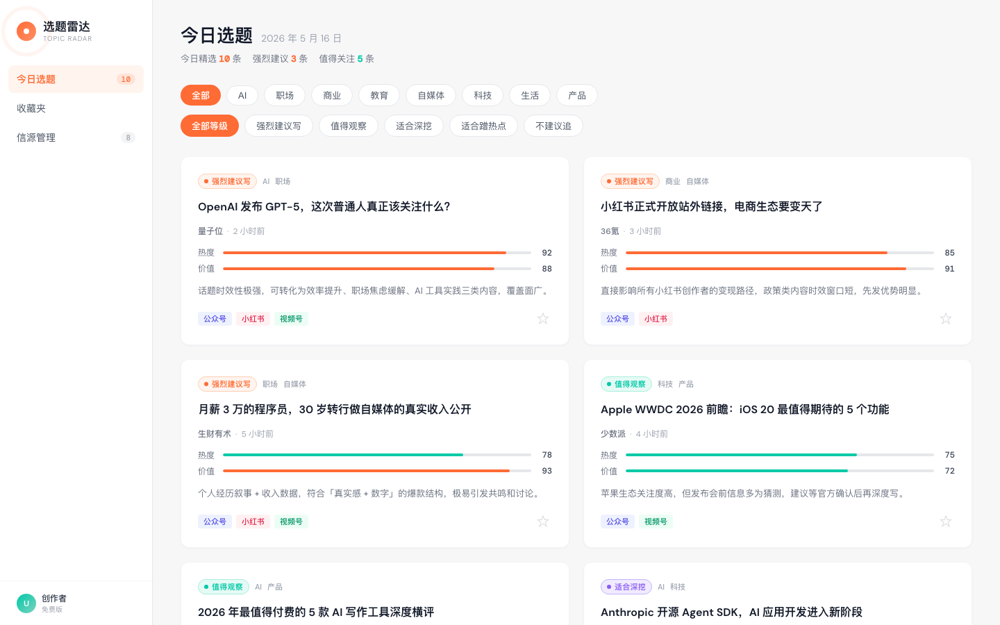
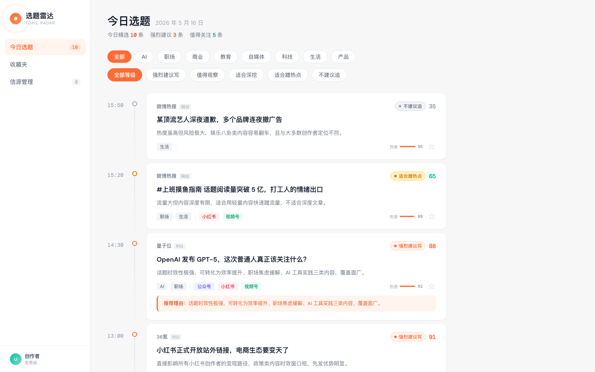
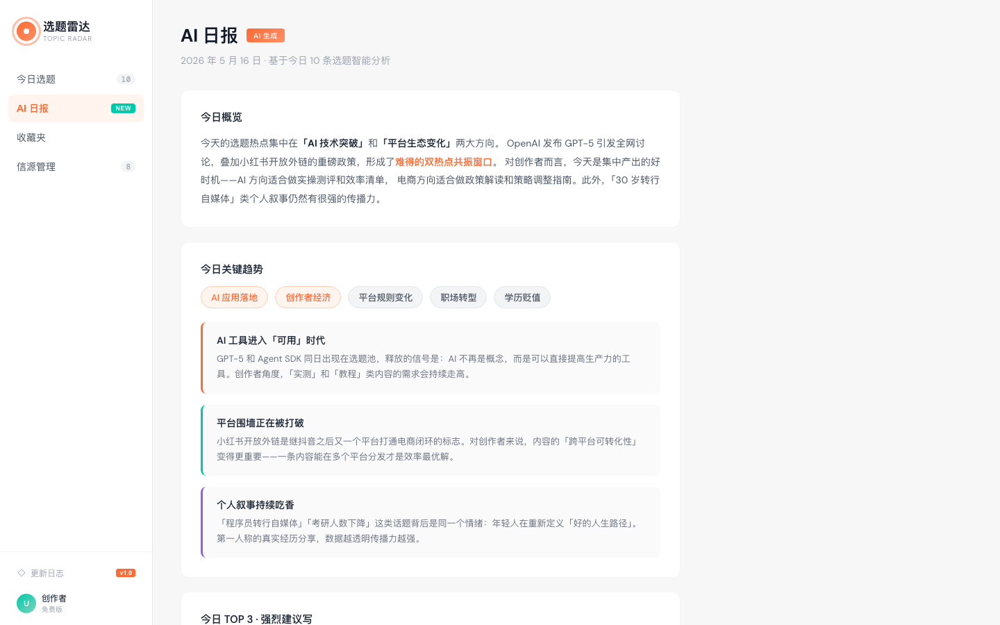

# TopicEye — 创作者选题雷达

[](LICENSE)
[](https://github.com/fxbin/TopicEye/actions/workflows/ci.yml)

[English](README.md) | [简体中文](README.zh-CN.md)

---

AI 驱动的内容发现与选题分析平台。TopicEye 持续抓取 25+ 信源（RSS / Reddit / YouTube / 播客 / Newsletter / 热榜），用一套透明的 6 维评分引擎给每条内容打分，把今天真正值得写的话题推到你面前。为被信息噪音淹没的内容创作者而做——不是又一个 RSS 阅读器。



## 核心特性

- **透明的评分引擎，不是黑盒。** 每条精选内容都带完整评分拆解：基础分（信息密度 / 可操作性 / 创作者价值 / 爆文潜力 / 来源权威 / 时效新鲜）、质量门槛、时效衰减、多样性惩罚、反馈信号。
- **反馈闭环校准。** 你的 👍 / 👎 不只是被收藏——它以 15% 权重回灌进排序权重，引擎越用越准。
- **支持自部署。** 完整 Docker 方案，SQLite 或 PostgreSQL，OAuth 登录（Google / GitHub）。数据归你所有。
- **Agent-native（规划中）。** 评分引擎正在以稳定 API 形式开放，让别的 Agent / 工具可以把它作为排序层调用。见 [路线图](ROADMAP.md)。

## 截图

| 今日精选 | 时间线 | 日报 |
|---|---|---|
|  |  |  |

## 功能模块

| 模块 | 说明 |
|------|------|
| 信源管理 | RSS / RSSHub / Reddit / YouTube / 播客 / Newsletter / 自定义网站。公共信源 + 用户私有信源双层模型。 |
| 内容精选 | 6 维 LLM 评分引擎 + 百分位截断 (P70) + 风险控制 + 用户反馈校准 |
| AI 分析 | 每条内容的摘要 / 关键点 / 选题建议（中英文差异化 prompt） |
| 日报 / 周报 | 自动从内容池生成，推送至通知中心 |
| 趋势雷达 | 关键词热度追踪 + 低粉爆文发现（在爆之前找到它） |
| 收藏夹 | 跨会话保存感兴趣的内容（按用户隔离） |
| OAuth 登录 | Google / GitHub（也支持邮箱密码） |

## 技术栈

- **后端：** FastAPI（异步）· SQLAlchemy 2.0 · Alembic · DuckDB（分析层）· httpx
- **前端：** Next.js 16 · React 19 · TypeScript · Tailwind CSS v4
- **数据库：** SQLite（默认）或 PostgreSQL · DuckDB 作为 OLTP 的只读分析层
- **认证：** 不透明 bearer token（DB hash）+ Authlib OAuth
- **基础设施：** Docker / docker-compose（dev + prod）· APScheduler

## 快速开始

### 环境要求

- Python 3.12+ · Node.js 20+ · Git
- **或** Docker + Docker Compose（最省事）

### 方式 A — Docker Compose（推荐）

```bash
git clone https://github.com/fxbin/TopicEye.git
cd TopicEye
docker compose up -d
```

- 前端：http://localhost:3000
- 后端 API 文档：http://localhost:8000/docs

### 方式 B — 本地开发

**1. 后端**（端口 8102）

```bash
cd TopicEye/backend
python -m venv venv && source venv/bin/activate
pip install -r requirements.txt
cp .env.example .env          # 按需修改
uvicorn app.main:app --host 127.0.0.1 --port 8102 --reload
```

**2. 前端**（端口 3000，新开终端）

```bash
cd TopicEye/frontend
npm install
npm run dev
```

浏览器打开 http://localhost:3000。

> **代理注意：** 如果系统开着 HTTP 代理（ClashX / Surge 端口 7890），确保 `localhost` 和 `127.0.0.1` 在「绕过代理」列表里，或设置 `BACKEND_API_URL=http://127.0.0.1:8102 npm run dev`。

## 配置

全部配置走环境变量，完整列表见 [`backend/.env.example`](backend/.env.example)。关键项：

| 变量 | 默认值 | 用途 |
|---|---|---|
| `DATABASE_URL` | `sqlite+aiosqlite:///./topiceye.db` | OLTP 数据库。切 Postgres 用 `postgresql+asyncpg://...` |
| `CORS_ORIGINS` | `http://localhost:3000,...` | 允许的前端来源，逗号分隔 |
| `OAUTH_GOOGLE_CLIENT_ID` / `_SECRET` | 空 | 启用 Google 登录。[申请指引](backend/.env.example) |
| `OAUTH_GITHUB_CLIENT_ID` / `_SECRET` | 空 | 启用 GitHub 登录 |
| `WEBNOVEL_CN_ENABLED` | `false` | 启用国内网文爬虫（番茄 / 七猫 / 知乎盐选）。默认关闭以保持国际化体验干净 |

## 开发

```bash
# 后端测试（使用隔离的测试库）
cd backend && python -m pytest tests/ -q

# 前端类型检查
cd frontend && npx tsc --noEmit

# 手动触发单个信源抓取
curl -X POST http://127.0.0.1:8102/api/v1/sources/1/sync
```

项目使用 Conventional Commits（`feat(auth): ...`、`fix(cache): ...`）。完整工作流见 [CONTRIBUTING.md](CONTRIBUTING.md)，本仓库强制执行的提交规范见 [AGENTS.md](AGENTS.md)。

## 路线图

刚发布 **v0.3.0**（公共/私有信源双层模型、用户专属日报）。接下来：

- **v0.4.0 — 开源就绪：** Apache-2.0 协议、英文 README、贡献者文档、信源贡献插件协议、网文配置开关。[完整路线图 →](ROADMAP.md)
- **v0.5.0 — Agent-native 评分 API：** 把 6 维评分引擎 + 低粉爆文识别以稳定 API（key 鉴权）开放，让别的 Agent 可以调用。
- **v0.6.0 — 商业化前置：** 多用户配额 + Stripe 订阅（只在真实采用信号出现后启动）。

## 贡献

欢迎贡献——尤其是**新信源连接器**（RSS 源、播客索引、Newsletter 爬虫、热榜）。每个连接器是一个自包含、边界清晰的 PR，非常适合作为首次贡献。

详见 [CONTRIBUTING.md](CONTRIBUTING.md)（环境搭建、代码风格、如何新增信源）。可以认领带 `good first issue` 标签的 issue 作为入门任务。

## 协议

基于 [Apache License, Version 2.0](LICENSE) 开源。Copyright © 2026 fxbin。
